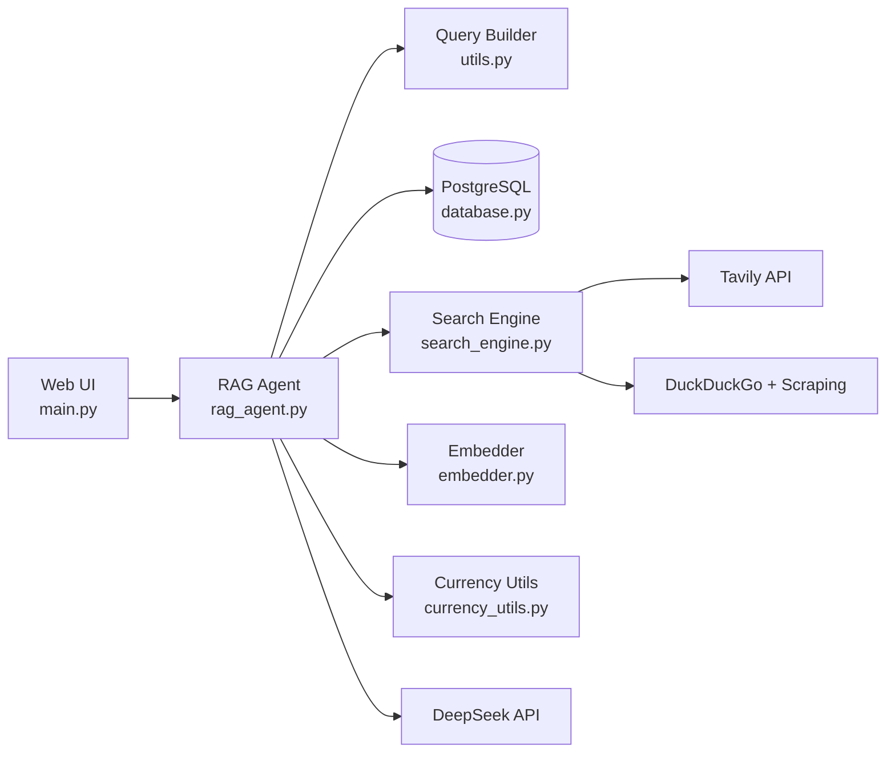

# Electronic Device Recommender

A RAG (Retrieval-Augmented Generation) web application that helps users find electronic devices based on natural-language preferences. It searches the web, ranks products with semantic similarity, filters by budget with currency conversion, and explains why each result matches.

## Features

- **Web UI** — Simple form for device type, country, brand, color, version, max price, and extra keywords
- **Hybrid search** — Tavily API first, DuckDuckGo + page scraping as fallback
- **Semantic ranking** — Sentence-transformer embeddings (`all-MiniLM-L6-v2`) with cosine similarity
- **Smart filtering** — Drops products without prices, outdated listings, and low-quality sources (forums, news)
- **Budget filtering** — Converts prices to the user's local currency based on country
- **Link validation** — Checks product URLs in parallel and deprioritizes blocked links
- **AI match reasons** — DeepSeek generates a short explanation for each recommendation
- **Result caching** — PostgreSQL cache (7-day TTL) to avoid repeat searches


## Architecture




## Project Structure


| File                 | Responsibility                                                  |
| -------------------- | --------------------------------------------------------------- |
| `main.py`            | FastAPI app, embedded HTML UI, SSE progress streaming           |
| `rag_agent.py`       | Core pipeline: cache → search → embed → filter → rank → explain |
| `utils.py`           | Text cleaning, spaCy keyword extraction, query building         |
| `search_engine.py`   | Tavily search, DuckDuckGo fallback, page scraping               |
| `embedder.py`        | Sentence-transformer embeddings and cosine similarity           |
| `currency_utils.py`  | Exchange rates, currency detection, price conversion            |
| `database.py`        | PostgreSQL search-result cache                                  |
| `models.py`          | Pydantic schemas (reference; not wired into routes yet)         |
| `docker-compose.yml` | PostgreSQL service                                              |


## Prerequisites

- Python 3.10+
- Docker Desktop (for PostgreSQL) 
- API keys (optional but recommended):
  - [Tavily](https://tavily.com/) — primary web search
  - [DeepSeek](https://platform.deepseek.com/) — match-reason generation


## Setup


### 1. Clone and create a virtual environment

```bash
git clone <repository-url>
cd Myproject1
python -m venv venv

# Windows
venv\Scripts\activate

# macOS / Linux
source venv/bin/activate
```


### 2. Install dependencies

```bash
pip install -r requirements.txt
pip install tavily-python spacy
python -m spacy download en_core_web_sm
```

> **Note:** `tavily-python` and `spacy` are used by the project but are not yet listed in `requirements.txt`. Consider adding them. Sometimes some dependencies can't install successfully in requirements.txt, it's needed to install individually again, e.g. `pip install ddgs`


### 3. Configure environment variables

Create/Modify a `.env` file in the project root (an example is shown below (**Never commit real API keys.**)). 
```env
# DeepSeek (falls back to generic match text)
DEEPSEEK_API_KEY=your_deepseek_api_key (**Need to corrected**)
DEEPSEEK_MODEL=deepseek-chat

# Tavily (falls back to DuckDuckGo + scraping)
TAVILY_API_KEY=your_tavily_api_key (**Need to corrected**)

# PostgreSQL
POSTGRES_USER=lpl (**Need to corrected**)
POSTGRES_PASSWORD=your_password (**Need to corrected**)
POSTGRES_DB=postgres
POSTGRES_HOST=localhost
POSTGRES_PORT=5433

# Search tuning
MAX_CANDIDATES=30
TOP_K=10
USER_AGENT=MyElectronicsBot/1.0 (+https://example.com/bot)
TARGET_SITES=
```

Modify `docker-compose.yml` file in the project root (an example is shown below).
```
version: '3.8'
services:
  postgres:
    image: postgres:latest
    environment:
      POSTGRES_USER: lpl (**Need to corrected**)
      POSTGRES_PASSWORD: lpl01470 (**Need to corrected**)
      POSTGRES_DB: postgres
    ports:
      - "5433:5432"
    volumes:
      - postgres_data:/var/lib/postgresqldocker-compose down
volumes:
  postgres_data:
```

### 4. Start PostgreSQL

```bash
docker-compose up -d
```

The database tables are created automatically on first run via SQLAlchemy.

### 5. Run the application

```bash
python -m uvicorn main:app --reload
```

Open [http://localhost:8000](http://localhost:8000) in your browser.

## Usage

1. Enter **Device type** (required), e.g. `laptop`, `phone`, `TV`
2. Enter **Country** (required), e.g. `US`, `UK`, `Taiwan` — used for currency conversion when filtering by price
3. Optionally fill in brand, color, version, max price, and extra keywords
4. Click **Search** and watch the progress bar
5. Review ranked recommendations with similarity scores, prices, and AI-generated match reasons


## API Endpoints


| Method | Path                      | Description                                          |
| ------ | ------------------------- | ---------------------------------------------------- |
| `GET`  | `/`                       | Web UI                                               |
| `POST` | `/recommend`              | Start a search; returns `{ "progress_id": "..." }`   |
| `GET`  | `/progress/{progress_id}` | Server-Sent Events stream for progress updates       |
| `GET`  | `/result/{progress_id}`   | Poll for final results (fallback if SSE disconnects) |


### Example: POST `/recommend`

Form fields:

- `device_type` (required)
- `country` (required)
- `brands`, `color`, `version`, `others` (optional strings)
- `price` (optional float — max budget in the country's currency)


## How the RAG Pipeline Works

1. **Query building** (`utils.py`) — Cleans input, extracts lemmatized keywords with spaCy, builds a search string
2. **Cache lookup** — Returns cached results if the same query was searched within 7 days
3. **Web search** — Tavily returns structured results; if unavailable, DuckDuckGo URLs are scraped for title, description, and price
4. **Embedding & ranking** — Each candidate is compared to the query via cosine similarity
5. **Heuristic adjustments** — Boost shopping pages; penalize news, reviews, forums, and blocked URLs
6. **Price filter** — Converts prices to the target currency and filters by max budget
7. **Match reasons** — DeepSeek explains why each top result fits the request
8. **Cache write** — Top results are stored in PostgreSQL


## Known Limitations

- Progress and results are stored in memory (`progress_store` in `main.py`) — not suitable for multi-worker deployments
- Tavily results often lack prices, so many may be filtered out before ranking
- Currency detection from URL domains is heuristic and may misidentify some sites
- `normalize_synonyms()` in `utils.py` is defined but not yet called in the query pipeline
- `models.py` Pydantic schemas are not yet used by FastAPI route handlers


## Development Notes

- Run PostgreSQL on port **5433** (mapped from container port 5432) to avoid conflicts with a local Postgres install
- Scraping respects `robots.txt` and uses a configurable `USER_AGENT`
- Old cache entries are purged automatically after 7 days


## License

This project is licensed under the [MIT License](LICENSE).