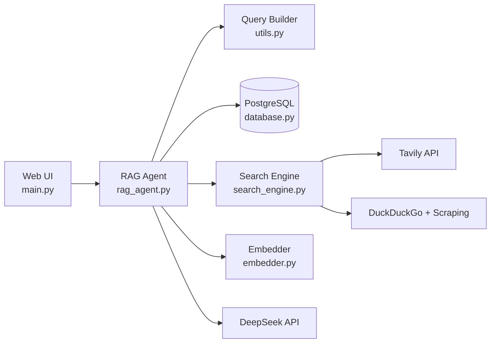

# Electronic Device Recommender

A RAG (Retrieval-Augmented Generation) web application that helps users find electronic devices based on natural-language preferences. It searches the web, ranks products with semantic similarity, applies domain and category weighting, and explains why each result matches.

## Features

- **Web UI** — Simple form for device type (required), brand, color, version, extra keywords, and optional cache bypass
- **Hybrid search** — Tavily API first (with query variants), DuckDuckGo + page scraping as fallback
- **Semantic ranking** — Sentence-transformer embeddings (`all-MiniLM-L6-v2`) with cosine similarity
- **Smart filtering** — Drops obsolete listings (older than last year), deprioritizes low-quality sources (forums, news, reviews)
- **Category & domain weighting** — Boosts e-commerce and shopping pages; penalizes homepages, landing pages, spec sites, and blocked URLs
- **Similarity boosts** — Extra weight for price presence, shopping keywords, brand match, and version match
- **Link validation** — Checks product URLs in parallel and deprioritizes blocked or inaccessible links
- **Keyword highlighting** — Shows which user-entered terms appear in each result
- **AI match reasons** — DeepSeek generates a short explanation for each recommendation (template fallback if no API key)
- **Result caching** — PostgreSQL cache (7-day TTL); use **Force refresh** to bypass cache and run a new search

## Architecture


```mermaid
flowchart LR
    UI[Web UI<br/>main.py] --> Agent[RAG Agent<br/>rag_agent.py]
    Agent --> Utils[Query Builder<br/>utils.py]
    Agent --> Cache[(PostgreSQL<br/>database.py)]
    Agent --> Search[Search Engine<br/>search_engine.py]
    Agent --> Embed[Embedder<br/>embedder.py]
    Search --> Tavily[Tavily API]
    Search --> DDG[DuckDuckGo + Scraping]
    Agent --> DeepSeek[DeepSeek API]
```

## Project Structure

| File                 | Responsibility                                                  |
| -------------------- | --------------------------------------------------------------- |
| `main.py`            | FastAPI app, embedded HTML UI, SSE progress streaming           |
| `rag_agent.py`       | Core pipeline: cache → search → embed → filter → rank → explain |
| `utils.py`           | Text cleaning, spaCy keyword extraction, query building         |
| `search_engine.py`   | Tavily search, DuckDuckGo fallback, page scraping               |
| `embedder.py`        | Sentence-transformer embeddings and cosine similarity           |
| `database.py`        | PostgreSQL search-result cache                                  |
| `models.py`          | Pydantic schemas (reference; not wired into routes yet)         |
| `docker-compose.yml` | PostgreSQL service                                              |

## Prerequisites

- Python 3.10+
- Docker Desktop (for PostgreSQL)
- API keys (optional but recommended):
  - [Tavily](https://tavily.com/) — primary web search
  - [DeepSeek](https://platform.deepseek.com/) — match-reason generation

## Setup

### 1. Clone and create a virtual environment

```bash
git clone <repository-url>
cd Myproject1
python -m venv venv

# Windows
venv\Scripts\activate

# macOS / Linux
source venv/bin/activate
```

### 2. Install dependencies

```bash
pip install -r requirements.txt
pip install tavily-python spacy
python -m spacy download en_core_web_sm
```

> **Note:** `tavily-python` and `spacy` are used by the project but are not yet listed in `requirements.txt`. Consider adding them. Sometimes some dependencies can't install successfully in `requirements.txt`; install individually if needed, e.g. `pip install ddgs`.

### 3. Configure environment variables

Create or modify a `.env` file in the project root:

```env
# DeepSeek (falls back to generic match text)
DEEPSEEK_API_KEY=your_deepseek_api_key
DEEPSEEK_MODEL=deepseek-chat

# Tavily (falls back to DuckDuckGo + scraping)
TAVILY_API_KEY=your_tavily_api_key

# PostgreSQL
POSTGRES_USER=your_username
POSTGRES_PASSWORD=your_password
POSTGRES_DB=postgres
POSTGRES_HOST=localhost
POSTGRES_PORT=5433

# Search tuning
MAX_CANDIDATES=30
TOP_K=10
USER_AGENT=MyElectronicsBot/1.0 (+https://example.com/bot)
TARGET_SITES=
```

Modify `docker-compose.yml` in the project root:

```yaml
version: '3.8'
services:
  postgres:
    image: postgres:latest
    environment:
      POSTGRES_USER: your_username
      POSTGRES_PASSWORD: your_password
      POSTGRES_DB: postgres
    ports:
      - "5433:5432"
    volumes:
      - postgres_data:/var/lib/postgresql/data
volumes:
  postgres_data:
```

### 4. Start PostgreSQL

```bash
docker-compose up -d
```

The database tables are created automatically on first run via SQLAlchemy.

### 5. Run the application

```bash
python -m uvicorn main:app --reload
```

Open [http://localhost:8000](http://localhost:8000) in your browser.

## Usage

1. Enter **Device type** (required), e.g. `laptop`, `phone`, `TV`
2. Optionally fill in **Brands**, **Color**, **Version**, and **Others** (extra specs or features)
3. Check **Force refresh (bypass cache)** if you want fresh web results instead of cached ones
4. Click **Search** and watch the progress bar
5. Review ranked recommendations with similarity scores, matched keywords, category labels, and AI-generated match reasons

### UI Rules

The web UI displays these guidelines next to the search form:

1. The system searches all your keywords; the **Keywords** line on each result shows which terms were found on the page.
2. For best results, enter only one brand and one color per field. Multiple brands and colors are not paired — they are mixed in a single search.
3. Classification prioritizes e-commerce pages (buying links, prices).
4. If a product is out of stock on one link, try another website from the results.
5. Please enter a suitable electronic device type.

## API Endpoints

| Method | Path                      | Description                                          |
| ------ | ------------------------- | ---------------------------------------------------- |
| `GET`  | `/`                       | Web UI                                               |
| `POST` | `/recommend`              | Start a search; returns `{ "progress_id": "..." }`   |
| `GET`  | `/progress/{progress_id}` | Server-Sent Events stream for progress updates       |
| `GET`  | `/result/{progress_id}`   | Poll for final results (fallback if SSE disconnects) |

### Example: POST `/recommend`

Form fields:

- `device_type` (required)
- `brands`, `color`, `version`, `others` (optional strings)
- `refresh` (optional boolean — when true, bypasses cache and runs a new search)

## How the RAG Pipeline Works

1. **Query building** (`utils.py`) — Cleans input, extracts lemmatized keywords with spaCy, builds a search string from device type, brands, color, version, and others
2. **Cache lookup** — Returns cached results if the same query was searched within 7 days (skipped when `refresh=true`)
3. **Web search** — Tavily runs up to 3 query variants (base query plus keyword-augmented variants); if unavailable, DuckDuckGo URLs are scraped for title, description, and price
4. **Embedding & ranking** — Each candidate is compared to the query via cosine similarity
5. **Heuristic boosts** — Similarity is increased when a result has a price (×1.15), shopping keywords (×1.05), brand match (×1.10), or version match (×1.15)
6. **Obsolete filter** — Drops products whose title or description references a year older than the previous calendar year
7. **Category & domain weighting** — E-commerce domains (HK, TW, CN, UK, international) receive bonus scores; non-shopping pages (reviews, forums, news, spec sites, homepages, landing pages) receive penalties; shopping intent in user input increases e-commerce weight
8. **Link validation** — Parallel HEAD requests; blocked URLs (403, Cloudflare, timeout, etc.) get an 80% similarity penalty
9. **Match reasons** — DeepSeek explains why each top result fits the request
10. **Cache write** — Top results are stored in PostgreSQL

### Result Categories

Each recommendation is labeled with one of:

| Category        | Label                              |
| --------------- | ---------------------------------- |
| `ecommerce`     | E-commerce / Official selling page |
| `homepage`      | E-commerce Homepage                |
| `landing_page`  | Listing Page                       |
| `official_spec` | Official Specs                     |
| `resale`        | Resale                             |
| `review`        | Review                             |
| `forum`         | Forum                              |
| `news`          | News                               |
| `unknown`       | Web                                |

## Known Limitations

- Progress and results are stored in memory (`progress_store` in `main.py`) — not suitable for multi-worker deployments
- Tavily results often lack prices, so price-based boosts may not apply to all candidates
- `normalize_synonyms()` in `utils.py` is defined but not yet called in the query pipeline
- `models.py` Pydantic schemas are not yet used by FastAPI route handlers
- Amazon links may be slightly penalized and can hide shipping or availability issues due to anti-scraping

## Development Notes

- Run PostgreSQL on port **5433** (mapped from container port 5432) to avoid conflicts with a local Postgres install
- Scraping respects `robots.txt` and uses a configurable `USER_AGENT`
- Old cache entries are purged automatically after 7 days
- Use the **Force refresh** checkbox or send `refresh=true` to the API to skip cache on repeat searches

## License

This project is licensed under the [MIT License](LICENSE).
